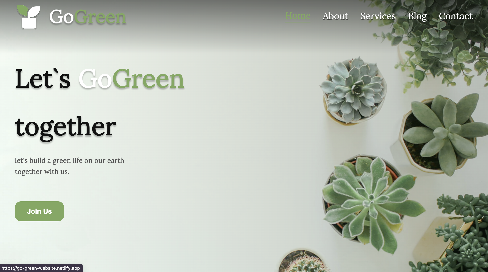
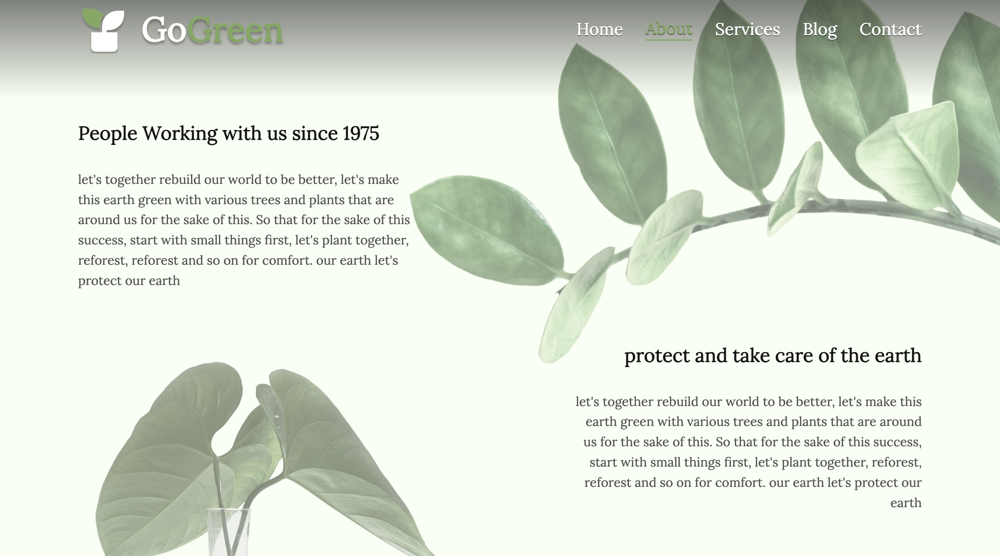
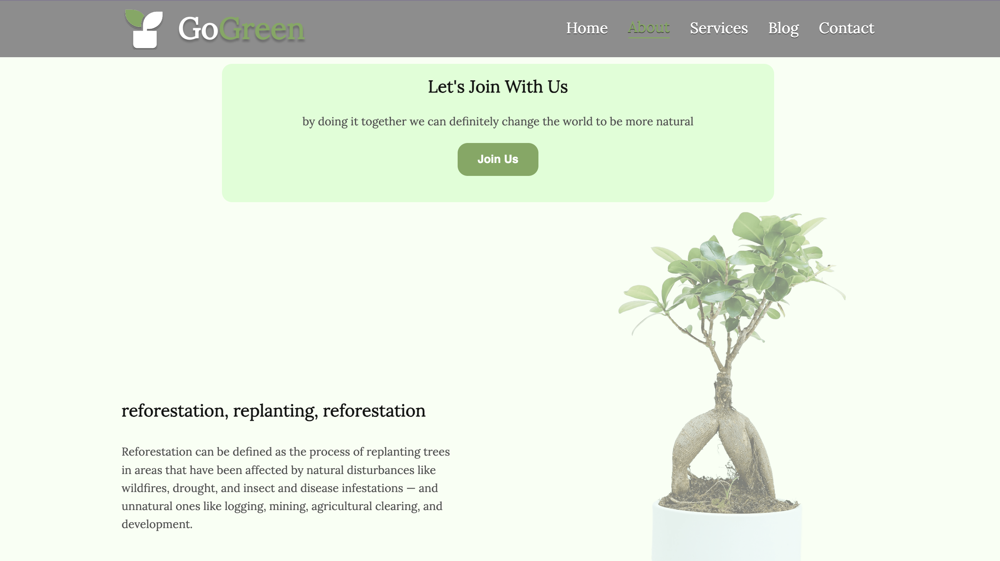
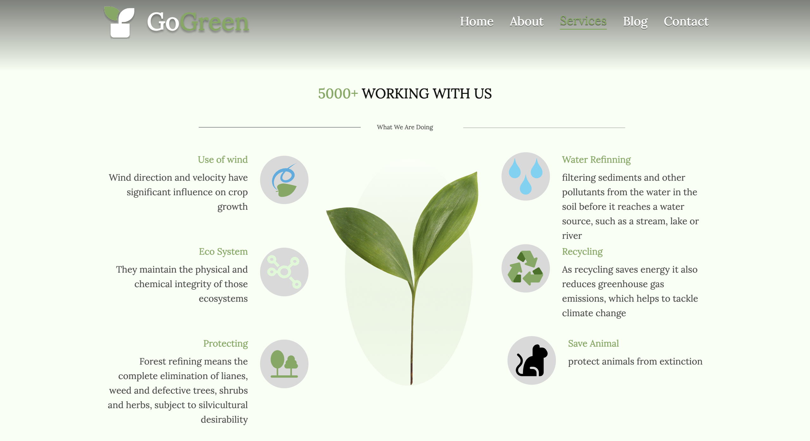
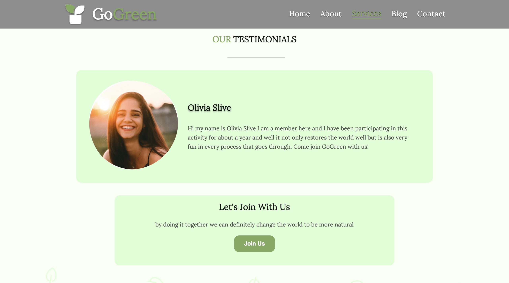
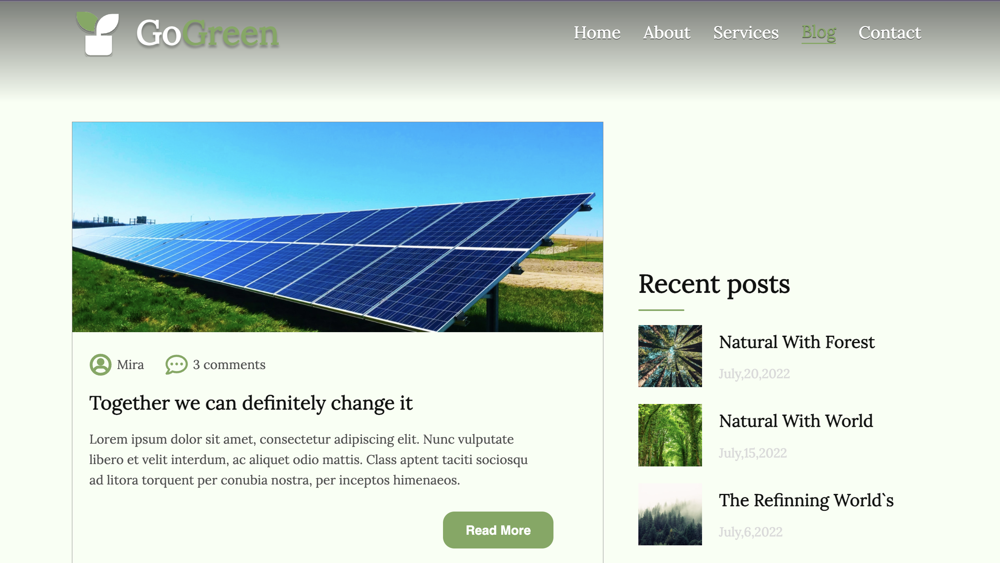
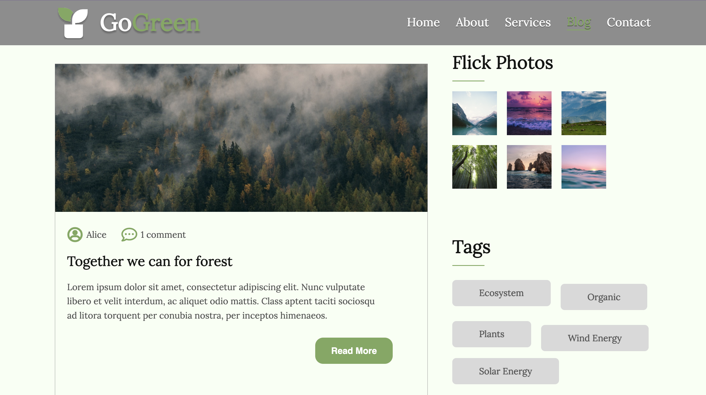
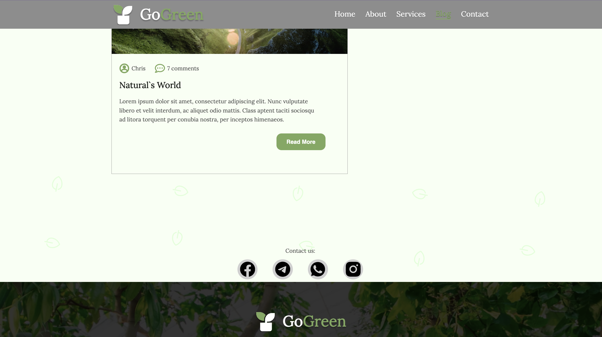
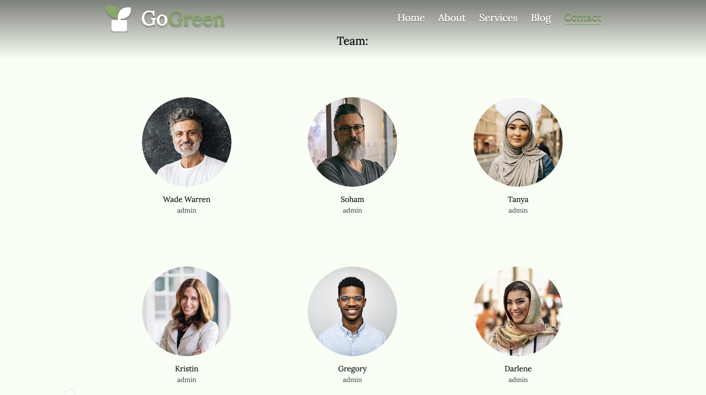

# GoGreen website created on React + TypeScript + Vite

This is beautiful website for lovers of beautiful design and plants deploy in [](https://app.netlify.com/sites/go-green-website/deploys)

## Table of Contents

- [Project overview](#project-overview)
- [Technologies and libraries used](#technologies-and-libraries-used)
- [Default documentation of Vite.js](#default-documentation-of-vitejs)
- [Screenshots](#screenshots)
  - [General information](#general-information)
  - [Expanding the ESLint configuration](#general-informatione)

## Project overview

With its help, the GoGreen company provides information about its services, as well as provides an opportunity for people to communicate with the agency and cooperate with the company.

## Technologies and libraries used

The project was implemented using the following technologies and libraries:

     

## Screenshots











# Default documentation of Vite.js

## General information

This template provides a minimal setup to get React working in Vite with HMR and some ESLint rules.

Currently, two official plugins are available:

- [@vitejs/plugin-react](https://github.com/vitejs/vite-plugin-react/blob/main/packages/plugin-react/README.md) uses [Babel](https://babeljs.io/) for Fast Refresh
- [@vitejs/plugin-react-swc](https://github.com/vitejs/vite-plugin-react-swc) uses [SWC](https://swc.rs/) for Fast Refresh

## Expanding the ESLint configuration

If you are developing a production application, we recommend updating the configuration to enable type aware lint rules:

- Configure the top-level `parserOptions` property like this:

```js
   parserOptions: {
    ecmaVersion: 'latest',
    sourceType: 'module',
    project: ['./tsconfig.json', './tsconfig.node.json'],
    tsconfigRootDir: __dirname,
   },
```

- Replace `plugin:@typescript-eslint/recommended` to `plugin:@typescript-eslint/recommended-type-checked` or `plugin:@typescript-eslint/strict-type-checked`
- Optionally add `plugin:@typescript-eslint/stylistic-type-checked`
- Install [eslint-plugin-react](https://github.com/jsx-eslint/eslint-plugin-react) and add `plugin:react/recommended` & `plugin:react/jsx-runtime` to the `extends` list
